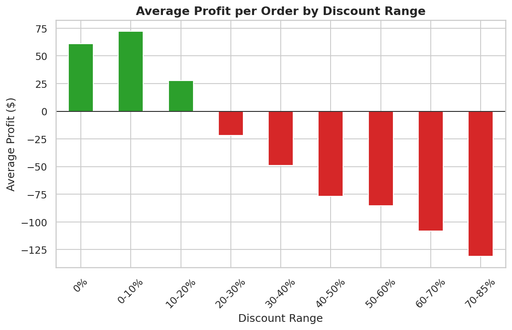

# Global Superstore Profitability Analysis (2011–2014)

A complete end-to-end data analysis project on the Global Superstore dataset (~51K order lines),
built to answer one central business question: **does sales volume actually translate into
profit — and if not, where exactly does it break down?**

🔗 **[Live Interactive Dashboard](https://USERNAME.github.io/global-superstore-analysis/dashboard/)** *(built with Plotly.js)*


## Business Problem

The company's sales are growing strongly across markets, but it isn't clear whether that
growth is translating into proportional profit, or which regions/categories/customer
segments are genuinely profitable versus which ones are losing money despite healthy sales.

## Dataset

- **Source:** Global Superstore dataset (`superstore_dataset2011-2015.csv`)
- **Scope used:** 2011–2014 *(add one line here explaining why 2015 was excluded, e.g. incomplete year)*
- **Size:** ~51K order lines (`XX,XXX` unique orders)
- **Key columns:** Order Date, Ship Date, Ship Mode, Segment, Market, Category, Sub-Category, Sales, Quantity, Discount, Profit

## Visual Highlights




## Key Insights

1. **Discounts above ~20% cost the company $814,682.** Those orders lose money in 89.9% of
   cases, across 11,328 order lines (22.1% of the total). Discount is the root cause of the
   weakest profitability points.
2. **Tables (Furniture) lose $64,083, driven entirely by heavy discounting.** Average
   discount on Tables is 29.1%, double the company average. The same product is profitable
   wherever discounting stays under 20%.
3. **EMEA has the weakest margin: 5.4% vs. ~11–13% elsewhere.** The cause is a systemically
   higher average discount rate (19.6%) applied across *all* categories, not a single
   product issue.
4. **Growth is healthy: 23.9% Sales CAGR (2011–2014)** with a stable overall margin
   (~11–12%). The issues above are localized, not systemic to the whole business.
5. **Ship Mode / Processing Time do not drive profitability** (tested, correlation ≈ 0).
6. **RFM customer segmentation:** Champions (21.8% of customers) generate 43.3% of total
   revenue. "Lost" is the largest segment by headcount (367 customers) but only 3.6% of
   revenue. The "At Risk (High Value)" segment (77 customers, 9.1% of revenue) is **not**
   discount-driven: they actually received the *lowest* average discount. This is an open
   question for further investigation (satisfaction, competition, etc.).

## Recommendations

> Draft — review and adjust to match your own reasoning.

| # | Based on | Recommendation |
|---|---|---|
| 1 | Insight 1 | Cap discounts at ~20% unless the order's margin stays positive; add an approval step above that threshold. |
| 2 | Insight 2 | Stop deep discounting on Tables; review pricing/sourcing and keep discounts under 20% where the product is profitable. |
| 3 | Insight 3 | Audit EMEA's discount policy across all categories and bring the average rate closer to other markets. |
| 4 | Insight 6 | Run a retention campaign for "At Risk (High Value)" customers, using surveys first (discounts are not the cause). |
| 5 | Insight 6 | Protect Champions with loyalty perks, since they drive 43.3% of revenue. |

## Methodology

1. **Data Cleaning** — parsed mixed-format date columns (validated via the logical rule
   `Ship Date >= Order Date`), engineered `Processing Time`, dropped non-analytical columns.
2. **EDA** — univariate, bivariate, and multivariate analysis across Sales, Profit,
   Discount, Category, Market, and Ship Mode.
3. **KPI Design** — 7 KPIs derived directly from EDA findings (not decided upfront).
4. **Insight Discovery & Validation** — every insight tested against sample size,
   outlier influence, and correlation-vs-causation before being accepted.
5. **RFM Segmentation** — customer-level lens (Recency, Frequency, Monetary) layered on
   top of the product/market findings.
6. **Recommendations** — each tied explicitly to a specific insight and its evidence.

## Project Structure

```text
global-superstore-analysis/
├── data/
│   ├── raw/                 # original, untouched CSV
│   └── processed/           # cleaned dataset used for all analysis
├── notebooks/               # 01 cleaning -> 05 RFM segmentation
├── src/                     # reusable cleaning / KPI / RFM / plotting functions
├── visualizations/          # exported chart PNGs (matplotlib/seaborn)
├── dashboard/               # Plotly.js dashboard (index.html + JS/CSS)
├── images/                  # README screenshots
├── presentation/            # final .pptx + speaker notes
├── requirements.txt
└── README.md
```

## How to Run

```bash
pip install -r requirements.txt
jupyter notebook notebooks/01_data_cleaning.ipynb
```

Or use the `src/` modules directly:

```python
from src.data_cleaning import load_and_clean_data
from src.kpi_calculations import kpi_summary
from src.rfm_analysis import segment_customers, segment_summary

df = load_and_clean_data("data/raw/superstore_dataset2011-2015.csv")
print(kpi_summary(df))
print(segment_summary(segment_customers(df)))
```

To view the dashboard, open `dashboard/index.html` in your browser (or use the live link above).
For Python Plotly charts, run `python src/interactive_plots.py` (requires `pip install plotly`).

## Tools

Python · Pandas · NumPy · Matplotlib · Seaborn · Plotly · Plotly.js · Jupyter

## Author

**Amin Reda** — Data Analyst & AI Automation
🔗 [LinkedIn](#) · 📧 your-email@example.com · 💻 [GitHub](#)
